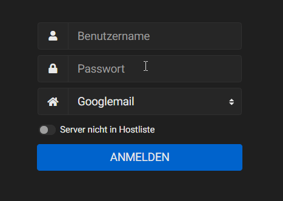

# Roundcube Hostmatch Plugin

Roundcube offers the option to enter multiple default hosts that are presented as drop-down list. This plugin adds a somewhat simple functionality to preselect the correct entry from that drop-down by matching the entered email address.

This plugin just adds a litte javascript code to the Roundcube login page and it is optimized for use with the Elastic skin, which was introduced in Roundcube 1.4.0.  
It *might* work with previous versions, but do not expect it to. You should use the legacy plugins for older Roundcube versions.

## Preview

## Links

[https://www.lostping.de](https://www.lostping.de)

[https://github.com/lostping/hostmatch](https://github.com/lostping/hostmatch)
  
## Kudos

This plugin is an overhaul of the plugins from **neurodeamon** as he doesn't continue to update them.

[https://github.com/neurodeamon/TinyHelpers-RoundcubePlugins](https://github.com/neurodeamon/TinyHelpers-RoundcubePlugins)